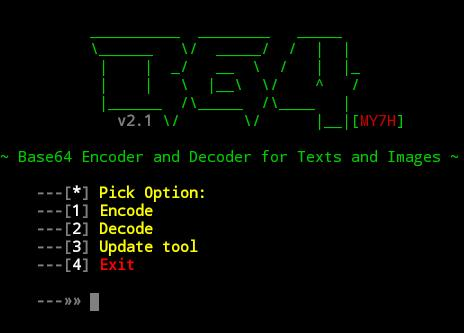

# <p align="center"> B64 </p>



**Base64 Encoder and Decoder for Texts and Images**

# <p align="center">Cloning</p>
```
cd $home
apt install update
apt install upgrade
apt install git
apt install python
git clone https://github.com/D-MythX/B64
cd B64
python req.py
python b64.py
```

# <p align="center"> + </p>
It can accept and save in text files.

# <p align="center">Made by </p>
**>>  MY7H**
<a href="https://github.com/D-MythX" >Follow please..<a>

# <p align="center">Credits</p>
**>>**
<a href="https://github.com/TermuxHackz">  Mr. Shell</a>  &  <a href="https://github.com/ebbieaden"> Ebbie</a>

